# Git Mastery Workshop — Visual Aid

> **Format:** This file uses [Mermaid](https://mermaid.js.org/) diagrams which render natively in GitHub, GitLab, Obsidian, VS Code (with extensions), and most modern markdown viewers.  
> **Reference:** Inspired by [ThePrimeagen — Everything You'll Need to Know About Git](https://theprimeagen.github.io/fem-git/)

---

## Table of Contents

1. [What is Git — Really?](#1-what-is-git--really)
2. [Git Internals — Under the Hood](#2-git-internals--under-the-hood)
3. [The Three Working Areas](#3-the-three-working-areas)
4. [Git as a Graph](#4-git-as-a-graph)
5. [Branches and HEAD](#5-branches-and-head)
6. [Branching Strategies](#6-branching-strategies)
7. [git merge — Combining Histories](#7-git-merge--combining-histories)
8. [git rebase — Replaying Commits](#8-git-rebase--replaying-commits)
9. [Merge vs Rebase — Decision Guide](#9-merge-vs-rebase--decision-guide)
10. [Conflict Resolution](#10-conflict-resolution)
11. [Recovery Tools — reflog, reset, revert](#11-recovery-tools--reflog-reset-revert)
12. [Golden Rules](#12-golden-rules)

---

## 1. What is Git — Really?

Git is a **distributed version control system** — not a cloud backup tool, not just GitHub.

> "Instead of a centralised system where checking out a file required admin privileges, Git allows all work to happen locally and may diverge as much as you want." — ThePrimeagen

### Key Terms

| Term | Meaning |
|---|---|
| **repo / work tree** | The git-tracked project directory |
| **commit** | A permanent point-in-time snapshot of the entire codebase |
| **SHA** | A 40-char hex hash uniquely identifying each object (commit, tree, blob) |
| **index / staging area** | Temporary area where you assemble changes before committing |
| **untracked** | Files Git has never seen — easiest to accidentally lose |
| **staged** | Changes added to the index, ready to be committed |
| **tracked** | Files already known to Git (previously committed) |
| **remote** | The same repo on another machine (e.g. GitHub) |
| **squash** | Combine N commits into 1 |

### Why does the SHA differ between developers?

A commit SHA is computed from:
- **Content** of the snapshot
- **Author** name and email
- **Timestamp**
- **Parent commit(s)** SHA

Change any of those → completely different hash. This is why your SHA will never match a colleague's.

---

## 2. Git Internals — Under the Hood

Git stores everything in `.git/objects/`. There are three object types:

```
commit  →  tree  →  blob
              └──→  tree  →  blob
```

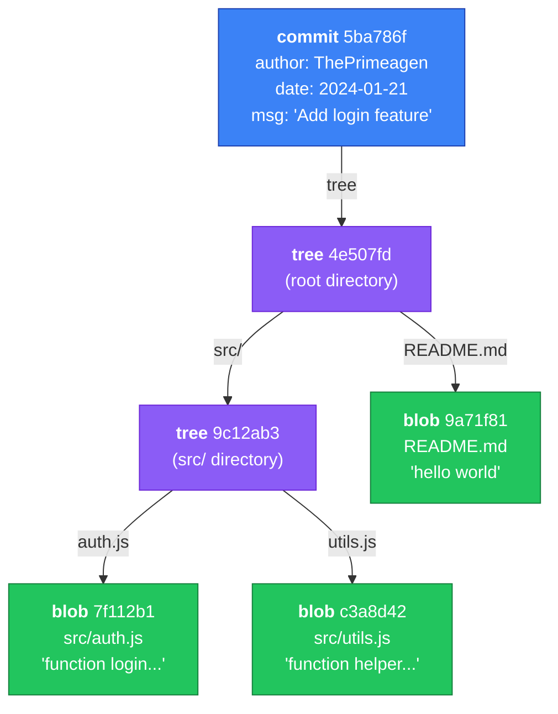

> **tree** ≈ directory &nbsp;|&nbsp; **blob** ≈ file

### The BIG Takeaway

**Git does NOT store diffs. Git stores complete snapshots of the entire source tree at every commit.**

Each blob is the full file content at that moment. Efficiency comes from *pointer reuse* — if `README.md` didn't change between commit A and commit B, both commits point to the *same blob SHA*. No duplication.

### Inspecting Internals Yourself

```bash
# See the commit graph
git log --oneline

# Cat out any object (commit, tree, or blob)
git cat-file -p <sha>

# Navigate: commit → tree → blob
git cat-file -p HEAD         # the current commit
git cat-file -p HEAD^{tree}  # the root tree
```

### Exercise

```bash
# 1. Make a commit
echo "hello" > first.md
git add . && git commit -m "first commit"

# 2. Find the commit SHA
git log --oneline

# 3. Navigate the object graph
git cat-file -p <commit-sha>      # shows tree + author + message
git cat-file -p <tree-sha>        # shows blob entries
git cat-file -p <blob-sha>        # shows file content
```

---

## 3. The Three Working Areas

Every file change passes through three areas before it's safely in history:

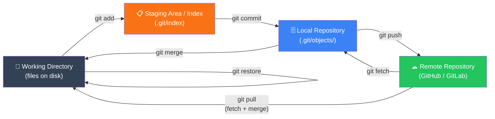

### Why does the staging area exist?

It lets you commit *selectively*. If you've edited 10 files but only 3 are ready, you stage and commit those 3. The other 7 stay in your working directory.

```bash
git status                # see all three areas at once
git diff                  # working dir vs staging
git diff --staged         # staging vs last commit
git add -p                # interactively stage hunks (very powerful)
```

---

## 4. Git as a Graph

Git history is a **Directed Acyclic Graph (DAG)** — each commit points to its parent(s). This means:

- Cycles are **impossible** (hence "acyclic")
- You can always trace history backwards from any commit
- Merge commits have **two parents**

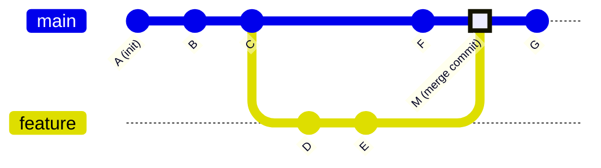

> Notice commit **M** — it has two parents (C's line and E's line). That's a merge commit.

### Commit Ancestry Notation

```bash
HEAD        # current commit
HEAD~1      # one commit before HEAD (parent)
HEAD~2      # two commits before HEAD (grandparent)
HEAD^1      # first parent (same as HEAD~1 for normal commits)
HEAD^2      # second parent (only valid on merge commits)
abc1234~3   # 3 commits before abc1234
```

---

## 5. Branches and HEAD

### What is a branch? (Really)

A branch is **nothing more than a file** containing a single 40-character commit SHA.

```bash
cat .git/refs/heads/main
# → a665b08b3e2f8d9c4ff71234567890abcdef1234

cat .git/refs/heads/feature/login
# → 16984cb1725b0bfeff43f60f92b3467ee6d525e3
```

Creating a branch costs almost nothing — it writes 41 bytes to disk. That's it.

### What is HEAD?

`HEAD` is another file pointing to *which branch you are currently on*.

```bash
cat .git/HEAD
# → ref: refs/heads/main       (normal state — "attached HEAD")

# After: git checkout abc1234
cat .git/HEAD
# → abc1234...                 (detached HEAD state — pointing to a commit directly)
```

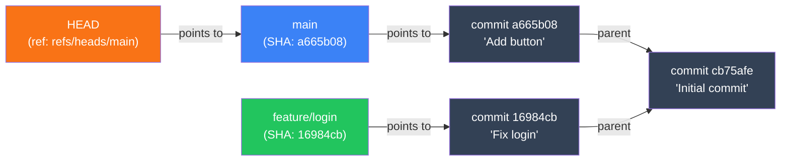

When you run `git switch feature/login`, Git updates `HEAD` to point to `feature/login`. The branch pointer (`feature/login`) advances automatically with every new commit you make.

### Branch Commands

```bash
git branch                    # list local branches (* = current)
git branch foo                # create branch 'foo' at current commit
git switch foo                # switch to foo (updates HEAD)
git switch -c feature/new     # create + switch in one step
git checkout -b feature/new   # older equivalent

git branch -d foo             # safe delete (refuses if unmerged)
git branch -D foo             # force delete

git log --oneline --graph --decorate --all   # visualise all branches
```

### Exercise: See branches as files

```bash
# Create a branch and inspect it directly
git branch my-test
cat .git/refs/heads/my-test    # shows the SHA it points to
git log --oneline -1            # should match the SHA above

# HEAD file
cat .git/HEAD                   # shows which branch you're on
git switch my-test
cat .git/HEAD                   # now points to my-test
```

---

## 6. Branching Strategies

### 6.1 Git Flow

Best for: **scheduled releases** (mobile apps, versioned software)

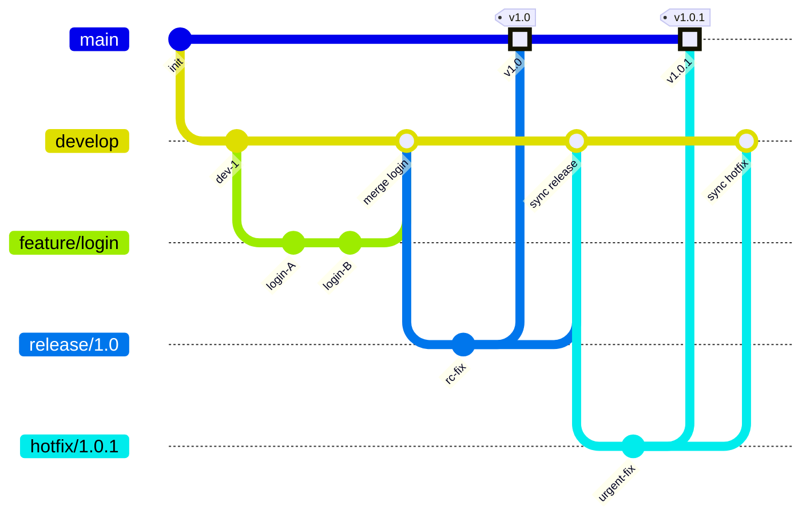

| Branch | Role |
|---|---|
| `main` | Production-ready only. Tagged at each release. |
| `develop` | Integration branch — features land here first. |
| `feature/*` | One per feature, branches from `develop`. |
| `release/*` | Stabilisation only (bug fixes). Merges into both `main` and `develop`. |
| `hotfix/*` | Emergency production fix. Branches from `main`. Merges into both. |

**When NOT to use Git Flow:** if you deploy multiple times a day. The ceremony (develop → release → main) adds friction.

---

### 6.2 GitHub Flow

Best for: **continuous deployment** (web apps, SaaS)

```mermaid
gitGraph
   commit id: "A"
   commit id: "B"
   branch feature/dashboard
   checkout feature/dashboard
   commit id: "dash-1"
   commit id: "dash-2"
   checkout main
   branch feature/auth
   checkout feature/auth
   commit id: "auth-1"
   checkout main
   merge feature/auth id: "PR merged" type: HIGHLIGHT
   merge feature/dashboard id: "PR merged" type: HIGHLIGHT
   commit id: "deploy"
```

**The rule:** `main` is **always deployable**. Branches are short-lived (hours to days).

```
1. git switch -c feature/my-thing   # branch from main
2. commit, commit, commit            # small focused commits
3. git push -u origin feature/my-thing  # push & open PR
4. code review                       # team reviews
5. CI passes                         # automated tests
6. merge PR into main → deploy       # ship it
```

---

### 6.3 Trunk-Based Development

Best for: **high-velocity teams** with strong CI/CD and feature flags.

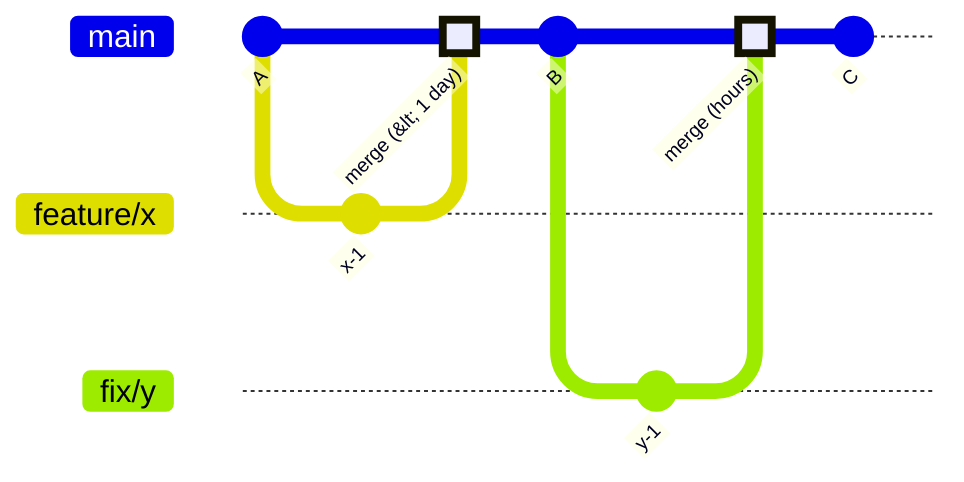

**Principle:** Everything goes to `main` frequently. Branches live for hours, not days. Feature flags hide incomplete work from users.

---

### Strategy Comparison

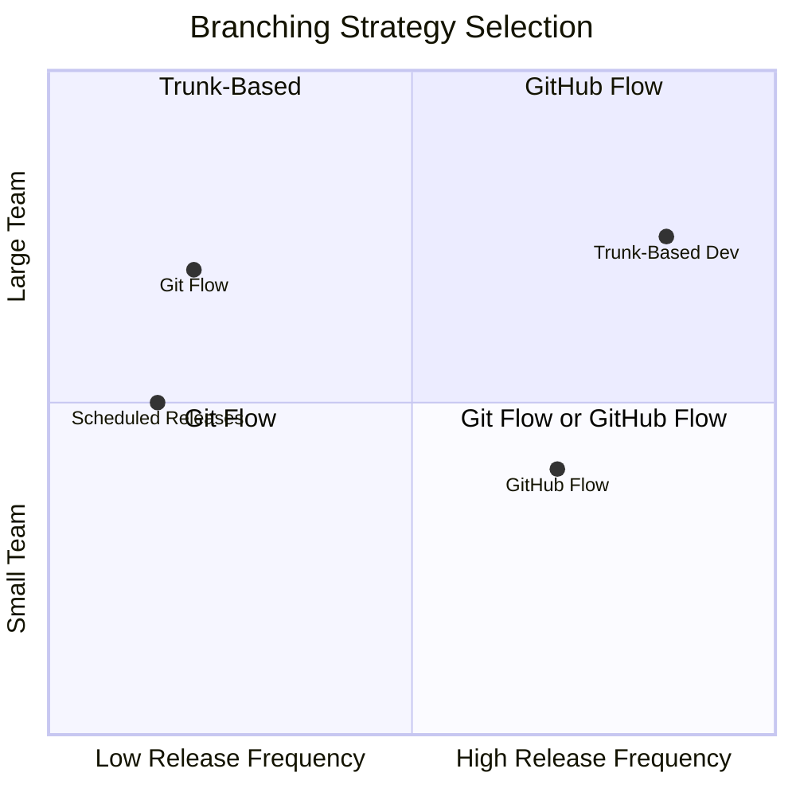

---

## 7. git merge — Combining Histories

A merge combines two branch histories that **diverged from a common ancestor** (called the *merge base* or *best common ancestor*).

### 7.1 Fast-Forward Merge

Happens when the target branch has **not diverged** — it's directly behind the source branch. Git simply moves the pointer forward. No merge commit created.

**Before:**
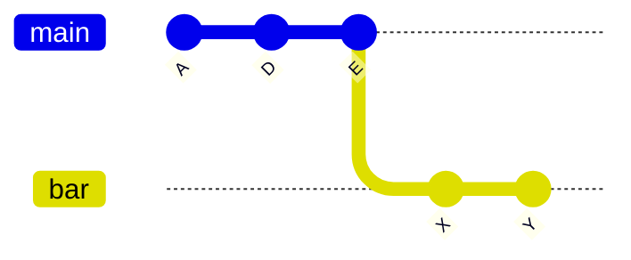

**After `git checkout main && git merge bar`:**
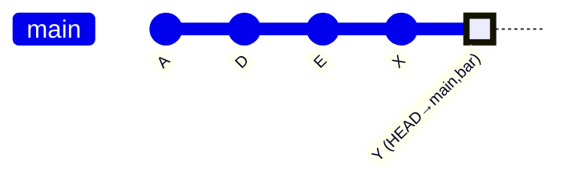

> `main` pointer just slid forward to `Y`. Clean, linear history. No extra commit.

```bash
git checkout main
git merge bar
# Output: Fast-forward
```

---

### 7.2 Three-Way Merge

Happens when **both branches have new commits** since they diverged. Git finds the merge base, computes the diff from both sides, and creates a new *merge commit* with **two parents**.

**Before:**
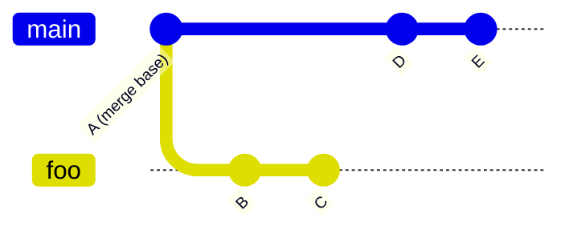

**After `git merge foo`:**
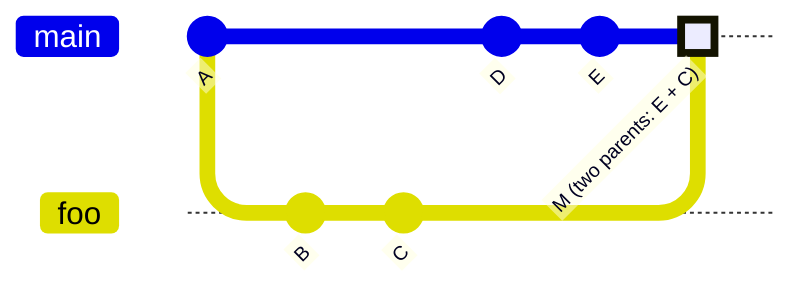

> Commit **M** has two parents. History is preserved — you can always see that the branch existed.

```bash
git checkout main
git merge foo         # opens editor for merge commit message
git merge --no-ff foo # force a merge commit even if FF is possible
git merge --squash foo # combine all of foo's commits into one staged change
```

---

### 7.3 Merge Commit Anatomy

```bash
git log --oneline --graph --parents --decorate

*   ccf9a73 a665b08 16984cb (HEAD -> main) Merge branch 'foo'
|\
| * 16984cb 4ad6ccf (foo) C
| * 4ad6ccf cb75afe B
* | a665b08 79c5076 E
* | 79c5076 cb75afe D
|/
* cb75afe A
```

Reading this: commit `ccf9a73` has **two parents** — `a665b08` (from main's line) and `16984cb` (from foo's tip).

---

### Merge Type Summary

| Type | Command | Creates merge commit? | Use when |
|---|---|---|---|
| Fast-forward | `git merge branch` | No | No divergence |
| Three-way | `git merge branch` (auto) | Yes | Both sides have commits |
| No-FF | `git merge --no-ff branch` | Always | You want branch visible in history |
| Squash | `git merge --squash branch` | No (staged only) | Messy feature history, want 1 clean commit |

---

## 8. git rebase — Replaying Commits

### What Rebase Actually Does

```
The basic steps of rebase:
1. git rebase <targetbranch>
2. Git checks out the latest commit on <targetbranch>
3. It replays commits from <currentbranch> one at a time onto that new base
4. Updates <currentbranch> to the new tip
```

Each replayed commit gets a **new SHA** (same content, different parent = different hash).

**Before rebase:**
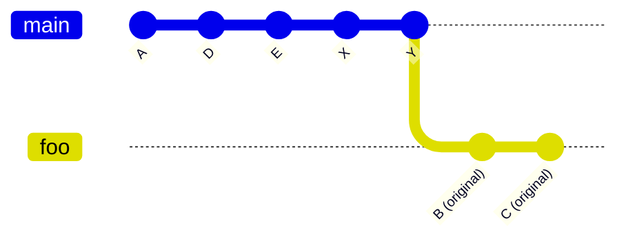

**After `git switch foo && git rebase main`:**
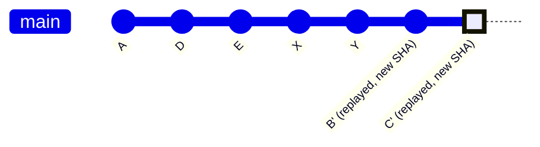

> `foo` now starts from `Y` instead of `A`. History is linear. If you now merge `foo` into `main`, it becomes a **fast-forward merge** — no merge commit needed.

```bash
git switch foo
git rebase main            # rebase foo onto main's tip

# If conflicts arise during rebase:
# 1. Fix the file
# 2. git add <file>
# 3. git rebase --continue  OR  git rebase --abort (to cancel entirely)
```

---

### Interactive Rebase — History Surgery

The most powerful rebase form lets you **rewrite, reorder, squash, or drop** commits before sharing them.

```bash
git rebase -i HEAD~4    # edit the last 4 commits interactively
```

The editor opens with something like:

```
pick a1b2c3d feat: add login page
pick e4f5a6b fix: typo in login
pick c7d8e9f fix: another typo
pick 1a2b3c4 feat: add logout button

# Commands:
# p, pick   = use commit as-is
# r, reword = use commit, but edit the commit message
# s, squash = meld into previous commit
# d, drop   = remove the commit entirely
# f, fixup  = like squash, but discard this commit's message
```

**Common pattern — squash WIP commits before a PR:**
```
pick a1b2c3d feat: add login page
fixup e4f5a6b fix: typo in login
fixup c7d8e9f fix: another typo
pick 1a2b3c4 feat: add logout button
```
Result: 2 clean commits instead of 4.

---

### Rebase Pro Tips

```bash
# Update your feature branch with latest main (before opening PR)
git switch feature/my-thing
git rebase main

# Rebase onto a specific commit
git rebase --onto main feature/old-base feature/my-thing

# Abort if things go sideways
git rebase --abort

# Continue after resolving a conflict
git add <resolved-file>
git rebase --continue
```

---

## 9. Merge vs Rebase — Decision Guide

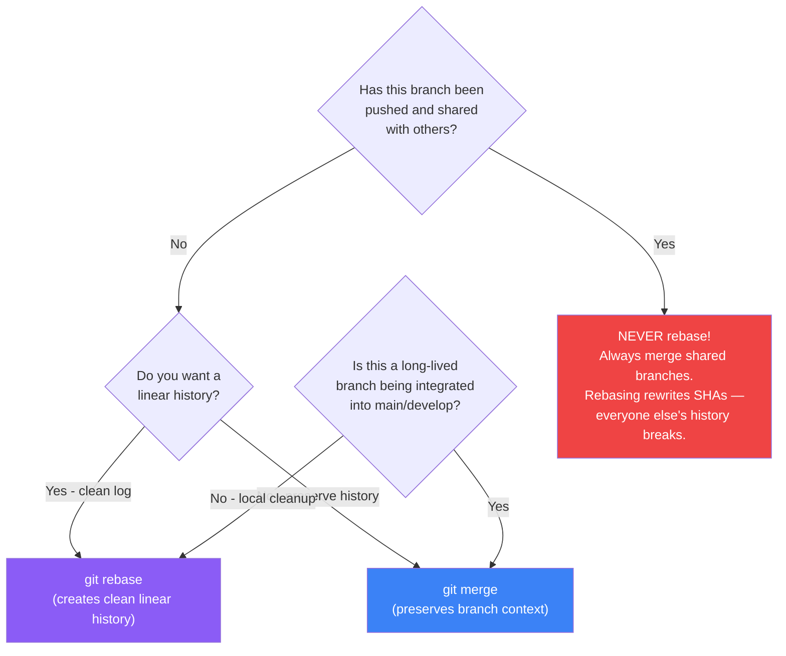

### Side-by-Side Comparison

| Dimension | `git merge` | `git rebase` |
|---|---|---|
| **History shape** | Non-linear — shows actual branch structure | Linear — looks like everything happened sequentially |
| **Merge commits** | Creates a merge commit (3-way) | No merge commits |
| **Commit SHAs** | Preserved | Rewritten (new SHA for each replayed commit) |
| **Safe on shared branches** | ✓ Always safe | ✗ Never — force-push required, breaks others |
| **Best for** | Integrating finished features into main | Updating local branch before opening a PR |
| **Conflict handling** | Resolve once in the merge commit | Resolve per replayed commit (can be more tedious) |
| **Audit trail** | Easy to see when branches diverged/merged | Harder to trace branch origin |

### The Golden Pattern

```bash
# Day-to-day: keep your branch current with rebase
git switch feature/my-thing
git rebase main              # replay your work on top of latest main

# When done: merge into main/develop
git switch main
git merge feature/my-thing  # now fast-forward (clean!) because you rebased
git push
git branch -d feature/my-thing
```

---

## 10. Conflict Resolution

### What Causes a Conflict?

Git resolves most changes automatically by tracking *which lines changed on which branch* relative to the common ancestor. A conflict only arises when **both branches modify the same lines** and Git cannot determine which is "correct".

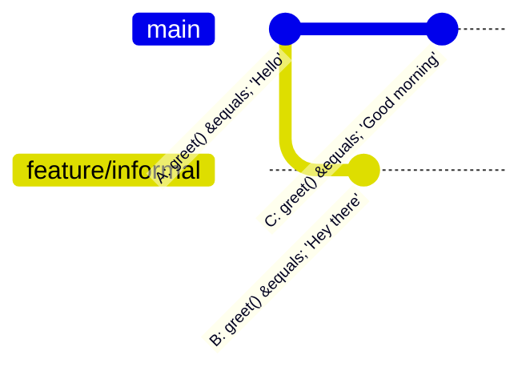

> Both B and C changed the same line from A. Merging B into main → CONFLICT.

---

### Reading Conflict Markers

When Git detects a conflict, it marks the file like this:

```
<<<<<<< HEAD
function greet() {
  return "Good morning";   ← your current branch (main)
}
=======
function greet() {
  return "Hey there";      ← incoming branch (feature/informal)
}
>>>>>>> feature/informal
```

| Marker | Meaning |
|---|---|
| `<<<<<<< HEAD` | Start of your current branch's version |
| `=======` | Divider |
| `>>>>>>> branch` | End of incoming branch's version |

Your job: **delete all three marker lines** and keep/combine whichever code is correct.

---

### Step-by-Step Resolution

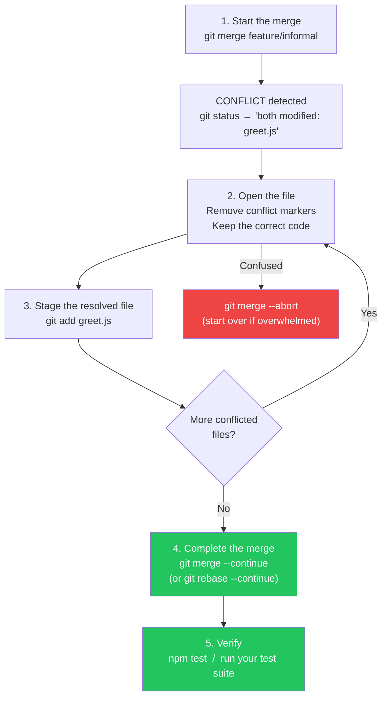

```bash
# 1. Trigger merge
git switch main
git merge feature/informal

# 2. See what's conflicted
git status
# → both modified: src/greet.js

# 3. Edit the file — remove <<<, ===, >>> markers

# 4. Stage the fixed file
git add src/greet.js

# 5. Finish
git merge --continue
# (or for rebase: git rebase --continue)

# 6. Test!
npm test
```

---

### Conflict Resolution Tools

```bash
# Use a visual merge tool
git mergetool           # opens configured visual tool (VS Code, vimdiff, etc.)

# Configure VS Code as merge tool
git config --global merge.tool vscode
git config --global mergetool.vscode.cmd 'code --wait $MERGED'

# See what the conflict base (common ancestor) looks like
git show :1:greet.js    # base (common ancestor version)
git show :2:greet.js    # ours (current branch)
git show :3:greet.js    # theirs (incoming branch)
```

---

### Exercise: Create and Resolve a Conflict

```bash
# Setup
mkdir conflict-demo && cd conflict-demo
git init

# Common ancestor
echo "Hello" > greet.txt
git add . && git commit -m "A: Hello"

# Branch 1 — modify the same line
git switch -c feature/informal
echo "Hey there" > greet.txt
git add . && git commit -m "B: Hey there"

# Branch 2 — main modifies same line differently
git switch main
echo "Good morning" > greet.txt
git add . && git commit -m "C: Good morning"

# Trigger the conflict
git merge feature/informal
# → CONFLICT (content): Merge conflict in greet.txt

# Resolve: edit greet.txt, pick the greeting you prefer
# Then:
git add greet.txt
git merge --continue
git log --oneline --graph
```

---

## 11. Recovery Tools — reflog, reset, revert

### reflog — Your Safety Net

`git reflog` records every position HEAD has been in — including branches you deleted.

```bash
git reflog
# Output:
# b23e632 (HEAD -> main) HEAD@{0}: checkout: moving from baz to main
# f330d23               HEAD@{1}: commit: Add baz feature     ← deleted branch commit!
# b23e632               HEAD@{2}: checkout: moving from main to baz
```

**Recover a "deleted" commit:**
```bash
git reflog                           # find the SHA
git checkout -b recovered f330d23    # restore it as a new branch
# or
git merge f330d23                    # bring it directly into current branch
```

---

### git reset — Undo Commits

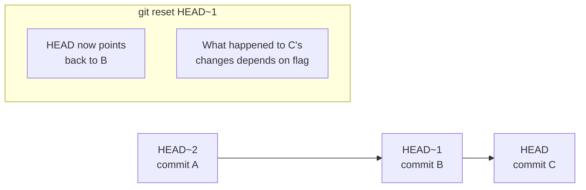

| Flag | Where do C's changes go? | Safe? |
|---|---|---|
| `--soft` | Back to staging (indexed) | Yes — changes preserved staged |
| `--mixed` (default) | Back to working directory | Yes — changes preserved unstaged |
| `--hard` | **Discarded permanently** | Danger — changes gone (use reflog to recover) |

```bash
git reset HEAD~1          # undo last commit, keep changes unstaged
git reset --soft HEAD~1   # undo last commit, keep changes staged
git reset --hard HEAD~1   # undo last commit, DISCARD changes (use with caution)
```

---

### git revert — Safe "Undo" for Shared Branches

`git revert` creates a **new commit** that undoes a previous one. History is not rewritten — safe on shared/public branches.

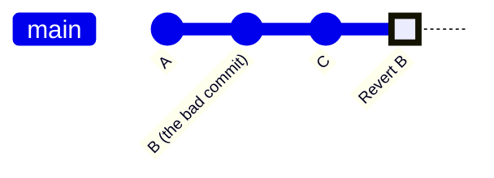

```bash
git revert abc1234        # creates a new commit reversing abc1234's changes
git revert HEAD           # revert the last commit
git revert HEAD~3..HEAD   # revert a range of commits
```

> Use `reset` on local/private branches. Use `revert` on shared branches.

---

### cherry-pick — Grab One Commit

Apply a single commit from anywhere in history onto your current branch:

```bash
git cherry-pick f330d23   # apply that specific commit here
```

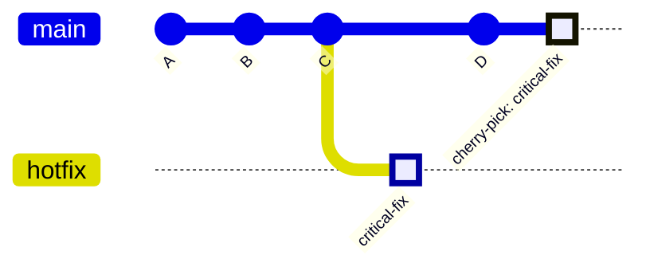

Useful when you need one specific fix from a branch without merging the whole thing.

---

## 12. Golden Rules

```mermaid
graph TD
    R1["01 — NEVER force-push to main or develop\nRewrites shared history → breaks everyone's repo"]
    R2["02 — Write meaningful commit messages\nUse imperative: 'Fix auth token expiry'\nnot 'fixed stuff'"]
    R3["03 — Commit small and often\nTiny commits = easy to review,\nrevert, and bisect bugs"]
    R4["04 — Branch before you change\nEvery feature/fix = a new branch.\nNever work directly on main"]
    R5["05 — Rebase locally, merge to integrate\nrebase your branch before PR;\nmerge when the feature is done"]
    R6["06 — NEVER rebase a public branch\nOnce pushed and shared,\nonly merge — never rebase"]
    R7["07 — Run tests before pushing\nBroken code on a shared branch\nblocks the whole team"]
    R8["08 — Use reflog before you panic\nAlmost nothing in Git is\npermanently lost"]

    style R1 fill:#EF4444,color:#fff
    style R6 fill:#EF4444,color:#fff
    style R2 fill:#F97316,color:#fff
    style R3 fill:#F59E0B,color:#fff
    style R4 fill:#22C55E,color:#fff
    style R5 fill:#3B82F6,color:#fff
    style R7 fill:#8B5CF6,color:#fff
    style R8 fill:#06B6D4,color:#fff
```

---

## Quick Reference Cheatsheet

### Setup
```bash
git init                           # initialise new repo
git clone <url>                    # clone remote repo
git config --global user.name "X"
git config --global user.email "X"
git config --global init.defaultBranch main
```

### Inspection
```bash
git status                         # three-area overview
git log --oneline --graph --all    # visual history
git diff                           # working dir vs staging
git diff --staged                  # staging vs last commit
git show <sha>                     # inspect one commit
git blame <file>                   # who changed what line
git reflog                         # full HEAD movement history
git cat-file -p <sha>              # raw object inspection
```

### Branching
```bash
git branch                         # list branches
git switch -c <branch>             # create + switch
git switch <branch>                # switch to existing
git branch -d <branch>             # safe delete
git branch -D <branch>             # force delete
git push -u origin <branch>        # push + track
git fetch --prune                  # sync, remove stale refs
```

### Merging & Rebasing
```bash
git merge <branch>                 # three-way or FF merge
git merge --no-ff <branch>         # force merge commit
git merge --squash <branch>        # squash to one commit
git merge --abort                  # cancel mid-merge
git rebase main                    # rebase onto main
git rebase -i HEAD~N               # interactive: edit last N commits
git rebase --continue              # after resolving conflict
git rebase --abort                 # cancel rebase entirely
git cherry-pick <sha>              # apply single commit
```

### Undoing
```bash
git restore <file>                 # discard working dir changes
git restore --staged <file>        # unstage
git reset HEAD~1                   # undo last commit (keep changes)
git reset --hard HEAD~1            # undo last commit (discard changes)
git revert <sha>                   # safe undo commit (new commit)
git stash                          # shelve uncommitted changes
git stash pop                      # restore shelved changes
```

---

### Commit Message Convention (Conventional Commits)

```
<type>(<scope>): <short imperative description>

Types:
  feat      New feature
  fix       Bug fix
  docs      Documentation only
  refactor  Code restructure, no feature/fix
  test      Add/update tests
  chore     Tooling, build, CI

Examples:
  feat(auth): add JWT refresh token rotation
  fix(api): handle null body in payment webhook
  refactor(db): extract connection pool to separate module
```

---

*Visual Aid · Git Mastery Workshop · May 2026*  
*Content inspired by [ThePrimeagen — Everything You'll Need to Know About Git](https://theprimeagen.github.io/fem-git/)*
